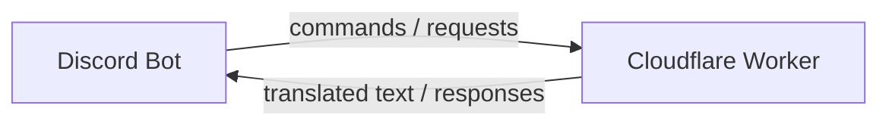

# Translation Flow

An app that translates novels from **Chinese (zh)** and **Korean (ko)** into **English**.

It consists of two parts:

1. **[Cloudflare Worker](#cloudflare-worker)** - hosts the translation API and the core logic.
2. **[Discord Bot](#discord-bot)** - the user-facing interface. Users interact with the app through the Discord bot, which calls the Cloudflare Worker's API behind the scenes.



> **Architecture note (decided):** These are not two separate deployments. There is **one Hono Worker** running a single app:
> - `POST /interactions` — the Discord webhook handler (verified via Discord public-key signature).
> - Internal route handlers implement the create/extract/translate logic, invoked in-process by the interaction handlers.
>
> There is **no public `/api` HTTP surface** and **no shared-secret auth** — the only external entry point is the Discord signature. If a third-party API consumer ever appears, extract the internal handlers into a second Worker behind a Cloudflare **Service Binding** (auth-free) at that point.

---

## Overview

- **Discord Bot**: The front door for users. It receives commands (for example, requesting a translation of a chapter), forwards them to the Cloudflare Worker, and returns the result to the user in Discord.
- **Cloudflare Worker**: Contains the translation logic, Discord interaction handling, and workflow orchestration. Users never talk to the Worker directly - all interaction goes through the Discord bot.

This separation keeps the translation logic on a serverless edge platform while presenting a simple, familiar interface to users via Discord.

---

## Cloudflare Worker

The Cloudflare Worker hosts the API and core translation logic. It is built with **[Hono](https://hono.dev)**, a lightweight web framework for edge workers. Long-running multi-step jobs (chapter extraction, notes extraction, chapter translation) run on **[Cloudflare Workflows](https://developers.cloudflare.com/workers/workflows/)**.

### Storage

- **R2** (Cloudflare's S3-compatible object storage) - stores uploaded raw files (the combined chapter text files) as well as individual extracted chapter files.
- **D1** (Cloudflare's relational SQLite) - hosts the `novel`, `chapter`, `notes`, and `workflows` tables.
- **Novel table** - a database table tracking each novel and its metadata.
- **Chapter table** - a database table tracking each extracted chapter belonging to a novel.
- **Notes table** - a database table storing named entities (characters, places, misc) per novel, with source and English name mappings.
- **Workflows table** - tracks every running/finished Cloudflare Workflow instance per novel and per chapter, so retries and overview progress always have a durable record.

#### R2 folder structure

Each novel is stored in R2 under a root folder named after the novel's `slug`:

```
novel-name/
├── source/
│   ├── full.txt 
│   └── chapters/
│       ├── 001.txt
│       ├── 002.txt
│       └── ...
├── translated/
│   ├── 001.md
│   ├── 002.md
│   └── ...
```

- `source/full.txt` - the original combined raw file uploaded when the novel is created.
- `source/chapters/` - the individual extracted chapters, stored as `.txt`.
- `translated/` - the translated chapters, stored as `.md`.

Chapter files are zero-padded based on the total number of chapters for the novel: the chapter number padded to the width of `total_chapters`. For example, a novel with 100 chapters uses 3 digits (`001.txt`, `002.txt`, …, `100.txt`); a novel with 12 chapters uses 2 digits (`01.txt`, …, `12.txt`).

> **Decided:** The user's declared `total_chapters` is only the *initial* expectation used for padding. If the extraction workflow discovers a different real count, it does **not** overwrite `total_chapters`. The overview embed shows an informational **warning** with the discovered count. Resolution is command-driven: re-running `/extract-chapters` retries extraction with the declared count; an explicit "adopt the discovered count" command is **parked**. Existing chapter files are overwritten idempotently.

#### Novel schema

The `novel` table tracks each novel and its processing state.

| Field                  | Type                                     | Description |
|------------------------|------------------------------------------|-------------|
| `id`                   | `number` (PK)                            | Primary key, unique identifier for the novel |
| `name`                 | `string` (unique)                        | Name of the novel |
| `slug`                 | `string` (unique)                        | Novel name in kebab-case |
| `source_language`      | `enum 'ko' \| 'zh'`                      | Source language of the novel |
| `source_url`           | `string`                                 | Original URL where the novel lives on the web |
| `total_chapters`       | `number`                                 | Total number of chapters in the novel |
| `status`               | `enum (default: 'pending')`              | One of: `pending`, `chapters_extracted`, `notes_extracted`, `translation_started`, `translated` |
| `channel_id`           | `string`                                 | Discord channel ID of the novel's channel (command routing) |
| `overview_message_id`  | `string`                                 | Discord message ID of the pinned overview embed (workflow progress edits target this exact message) |
| `last_error`           | `string` (nullable)                      | Last workflow error message for this novel, displayed in the overview embed; set when a workflow fails, cleared/overwritten on the next workflow run |

Schema decisions:

- `source_language` uses the ISO codes **`zh`** and **`ko`** everywhere.
- **Unique constraints** on both `name` and `slug`. On collision at creation the request is rejected and the user renames manually (no auto-suffix).
- Is this novel busy?" is derived from the `workflows` table.
- `created_at` / `updated_at` timestamps are implied and should be added.

**Pipeline status transitions (decided):**

```
pending → chapters_extracted → notes_extracted → translation_started → translated
```

- `pending` — created, raw file stored in R2.
- `chapters_extracted` — extraction workflow completed.
- `notes_extracted` — notes workflow completed.
- `translation_started` — set when the **first** chapter finishes translating (explicit DB write).
- `translated` — set only when **every** chapter has `is_translated = true`; derived after each translation workflow by checking `COUNT(is_translated = false) == 0`.

Dependency guard: `/translate-chapter` requires `status = notes_extracted` so the name map exists.

#### Chapter schema

The `chapter` table stores each extracted chapter of a novel, broken out from the combined raw file.

| Field            | Type                                     | Description |
|------------------|------------------------------------------|-------------|
| `id`             | `number` (PK)                            | Primary key, unique identifier for the chapter |
| `novel_id`       | `number` (FK → `novel.id`)               | The novel this chapter belongs to |
| `chapter_number` | `number`                                 | Chapter order/number within the novel |
| `r2_key`         | `string`                                 | Reference to the chapter file stored in R2 |
| `is_translated`  | `boolean` (default: `false`)             | Whether the chapter has been translated |

Translation progress for the overview embed is derived from this table (`x / total` chapters translated). Per-chapter translation failures are recorded in the `workflows` table (see below), not in this table.

#### Notes schema

The `notes` table stores named entities (characters, places, and misc terms) for each novel, along with their source-language name, English name mapping, and a description.

| Field            | Type                                                         | Description |
|------------------|--------------------------------------------------------------|-------------|
| `id`             | `number` (PK)                                                | Primary key, auto-incrementing identifier |
| `novel_id`       | `number` (FK → `novel.id`, cascade on delete)                | The novel this note entry belongs to |
| `category`       | `string` (check: `'characters'`, `'places'`, `'misc'`)       | Category of the note entry |
| `source_names`   | `string` (`;`-separated)                                     | Source-language names / aliases / variations for the entity |
| `english_names`  | `string` (`;`-separated, aligned by position)                | English translated names |
| `description`    | `string`                                                     | Description of the entity (`;`-separated facts) |
| `created_at`     | `string`                                                     | When the entry was created |
| `updated_at`     | `string`                                                     | When the entry was last updated |

Notes behavior is driven by `src/instructions/notesInstructions.ts` (`NOTES_INSTRUCTIONS`, the extraction/update instruction file):

- Multiple known names, aliases, titles, and forms of address for one entity are stored as `;`-separated pairs, aligned by position between `source_names` and `english_names`.
- When a new alias/variation (including misspellings) is discovered, it is **appended** to the existing entry; entries are not duplicated.
- Each notes run returns a `notesChanges` diff (`updates` / `additions` / `deletions`); the application applies it, merging rather than blindly overwriting. Duplicate entries are merged in-instruction.
- At per-chapter filter time, `source_names` is split on `;` and each variation is checked against the chapter text — so typos stored as variations are still caught at translation time.

#### Workflows schema

Tracks every Cloudflare Workflow instance so progress can be rendered and so failed steps can be re-run.

| Field            | Type                                     | Description |
|------------------|------------------------------------------|-------------|
| `id`             | `number` (PK)                            | Primary key, auto-incrementing |
| `novel_id`       | `number` (FK → `novel.id`)               | The novel this workflow belongs to |
| `chapter_id`     | `number` (FK → `chapter.id`, nullable)   | The chapter, for per-chapter translation workflows |
| `type`           | `string`                                 | One of: `extract_chapters`, `extract_notes`, `translate_chapter` (lowercase) |
| `instance_id`    | `string`                                 | Cloudflare Workflows instance ID |
| `status`         | `string`                                 | Running / success / failed (mirrors instance status) |
| `started_at`     | `string`                                 | When the workflow started (cached from instance status) |
| `finished_at`    | `string`                                 | When the workflow finished (cached; nullable while running) |

Decisions:

- This table is the durable record of **all** workflow types: extraction workflows run once per novel, translation workflows run **per chapter** (one per call, several may be live at once).
- Querying by `novel_id` (and optionally `chapter_id`) is how retries and the overview progress embed find their workflows.
- `started_at` / `finished_at` are cached from Workflows' `getInstanceStatus()` so rendering never requires a live API call.
- **Duplicate-start race is accepted** — no pre-start guard against launching two extraction workflows for the same novel.
- Failure semantics hang off this table: a chapter translation that exhausts its retries leaves a `failed` workflow row for that `chapter_id`, and the user re-runs via `/translate-chapter <n>`.

### Internal Operations

These are **internal handlers** invoked by the Discord interaction handlers in the same Worker. They are documented here because they define the core logic and each operation's data flow.

#### Create Novel

Creates a new novel from an uploaded raw file.

**Inputs**

| Field            | Type   | Description |
|------------------|--------|-------------|
| `novel_name`     | string | Name of the novel |
| `source_language`| string | Source language (`zh` or `ko`) |
| `total_chapters` | number | Total number of chapters in the novel (initial expectation; see warning flow above) |
| `source_url`     | string | Original URL where the novel lives on the web |
| `rawFile`        | file   | A `.txt` file containing **all chapters**, delivered as a Discord attachment |

**Behavior**

1. Receives the novel metadata and the raw `.txt` file (all chapters combined into one file).
2. Fetches the Discord attachment from its CDN URL and uploads the file to **R2** as `source/full.txt`.
3. Creates a new entry in the **novel table** with the provided metadata and a reference to the uploaded file. The novel is created with `status` set to `pending`.
4. On success the Discord handler builds the category/channel, posts the overview embed, and pins it (see Discord Bot section).

> **Parked:** deleting the Discord CDN copy after a successful R2 upload. Currently the attachment stays on the CDN.

#### Start Chapter Extraction

Starts a Cloudflare Workflow that breaks a novel's combined raw file into individual chapters.

**Input:** `novelId`.

**Behavior**

1. Fetches the novel's raw file (the combined chapter text file) from **R2**.
2. Reads `source_url` from the novel and parses it to discover all the possible chapter headings for the novel. (The source site's structure is fixed, so this parsing is trusted; no LLM-based splitting.)
3. Uses those chapter headings as boundaries to break the raw file into separate chapters.
4. Uploads each extracted chapter to **R2**.
5. Creates a new entry in the **chapter table** for every extracted chapter (linked to the novel via `novel_id`).
6. Updates the novel's `status` to `chapters_extracted` once all chapters have been extracted and uploaded.
7. If the discovered chapter count differs from `total_chapters`, add an informational warning line to the overview embed (see the total-chapters warning in the schema section).

#### Start Notes Extraction

Starts a Cloudflare Workflow that extracts notes (named entities such as characters, places, and misc terms) from every chapter of a novel.

**Input:** `novelId`.

**Behavior**

1. Fetches all chapters belonging to the novel from the **chapter table**.
2. For each chapter (sequentially):
   1. Gets the raw chapter content from **R2** using the chapter's `r2_key`.
   2. Fetches the novel's notes from the **notes table**.
   3. Filters the notes to only those whose `source_names` appear in the raw chapter content (splitting `source_names` on `;` and matching each variation; keeps the entities relevant to this chapter, drops unused ones).
   4. Passes the **filtered notes object** (the note entries for the filtered names only, not all notes) together with the raw chapter content to the model with the notes extraction instructions (`src/instructions/notesInstructions.ts`).
   5. Applies the returned `notesChanges` diff to the **notes table** (updates / additions / deletions) — merging with existing entries, never blind-overwriting.
3. Continues these steps for each chapter until all chapters have been processed.
4. Updates the novel's `status` to `notes_extracted` once all chapters have been processed.

#### Start Chapter Translation

Starts a Cloudflare Workflow that translates a single chapter into English, using the novel's extracted notes to keep named entities consistent.

**Input:** `chapterId`.

**Behavior**

1. Gets the raw chapter content from **R2** using the chapter's `r2_key`.
2. Fetches all notes belonging to the chapter's novel from the **notes table**.
3. Filters the notes to only those whose `source_names` appear in the raw chapter content (same `;`-split matching as notes extraction; keeps relevant entities, drops unused ones).
4. Passes the filtered notes (each with its `source_names` and `english_names`) together with the source chapter text to the translation model, using the translation instructions (`src/instructions/translationInstructions.ts`).
5. Writes the translated text to **R2** in the novel's `translated/` folder as a `.md` file, matching the chapter's padded file name (e.g. `001.md`). Re-translating a chapter **overwrites** the fixed key (no versioning).
6. Marks the chapter `is_translated = true`.
7. Updates the novel's `status`: set `translation_started` when the first chapter finishes; set `translated` when `COUNT(is_translated = false) == 0`. Requires `status = notes_extracted` to run.
8. Pushes a progress update to the stored (pinned) overview message (see Discord Bot).

**Resilience (decided):**

- **One chapter per model call** — no batching. Keeps error recovery, progress tracking, and context windows simple.
- **Per-chapter retries** with exponential backoff. On final failure, the workflow row is marked `failed` for that chapter and the workflow continues with other chapters (or reports the single failure); the user re-runs via `/translate-chapter <n>`.
- **No concurrency guard** on translation workflows — assume the user starts one active workflow per chapter.

**Model choice (parked):** the LLM provider/model is not decided yet (cost vs quality trade-off, especially for chapter translation). The pipeline is model-agnostic; this should be a configuration-level swap, not a code-level change.

**Instructions:** one shared `src/instructions/notesInstructions.ts` / `src/instructions/translationInstructions.ts` template for both source languages, parameterized by `source_language` at call time (e.g. Korean romanization vs Chinese pinyin name rendering). The common trust-boundary section lives in `src/instructions/commonInstructions.ts` and is injected into both via template literals.

---

## Discord Bot

The Discord bot is the user-facing interface. Users interact with the app entirely through Discord commands.

### Channel Structure

When a novel is created, the bot sets up a dedicated category with a **single channel** per novel:

```
📁 <novel-name (kebab-case)>
└── #<novel-name>     — the novel's channel: commands run here, status lives here
```

- The novel's channel is the **only** channel for that novel: all novel-specific commands (`/extract-chapters`, `/extract-notes`, `/translate-chapter`, `/status`) are available here, and the overview embed is pinned here.
- There is **no separate `#overview` channel** (decided 2026-09-26). Status is a pinned message, not a second channel.

The IDs (`channel_id`, `overview_message_id`) are stored on the `novel` row — command routing and progress edits always target these exact stored IDs, never "find the newest message." A novel command run outside its novel's channel replies with a helpful error naming the correct channel.

### Overview Message

A single **embed — no message components** — posted once when the novel is created and **pinned** in the novel's channel, showing the novel's details and status:

```
📖 My Great Novel
━━━━━━━━━━━━━━━━━━━
Language:   Chinese (zh)
Chapters:   34 / 100 translated
Status:     In Progress (translation)
━━━━━━━━━━━━━━━━━━━
```

- The embed is **display-only** — it has no message components (buttons). Every action is a slash command (2026-09-26).
- `/status` re-renders this same overview from D1 on demand (see Commands below).

### Progress Updates (push, not poll)

Long-running workflows update the pinned overview embed **by pushing from inside the workflow** — there is no persistent polling process in a Worker:

- The workflow step that completes (or reaches a progress point) calls the Discord REST API to edit the stored `overview_message_id` **in place** (the pinned message), authorized with the long-lived **bot token** (`Authorization: Bot <BOT_TOKEN>`), not the short-lived interaction webhook token.
- Progress edits target the pinned overview message **only** — the workflow never posts new chat messages into the channel, so status and conversation stay separate by construction.
- Progress counts are derived from D1 (`chapter.is_translated`) at each edit, so concurrent workflows can't corrupt the display.

### Interaction Handling

Discord requires an initial response within **3 seconds** or the interaction token expires. Commands that kick off long workflows use Discord's **`DEFERRED_CHANNEL_MESSAGE_WITH_SOURCE`** interaction response type:

1. Receive the command.
2. Respond immediately with a deferred "Working on it…" ack (ephemeral, so only the operator sees it).
3. Start the Cloudflare Workflow and record it in the `workflows` table.
4. The workflow pushes progress edits to the pinned overview message as it runs.

### Commands

#### `/create-novel`

Creates a new novel.

**Flow**

1. A user runs `/create-novel`.
2. A **modal** opens asking for all the required fields for the Create Novel operation:

   | Modal Field         | Type     | Description |
   |---------------------|----------|-------------|
   | `novel_name`        | text     | Name of the novel |
   | `source_language`   | select   | Source language (`zh` for Chinese, `ko` for Korean) |
   | `total_chapters`    | integer  | Total number of chapters in the novel |
   | `source_url`        | text     | Original URL where the novel lives on the web |
   | `raw_file`          | attachment | A `.txt` file containing all chapters combined |

3. On successful creation:
   - A new Discord **category** is created for the novel, named in `kebab-case` (e.g. `my-great-novel`).
   - A single channel is created inside that category (the novel's `channel_id`).
4. Inside the novel's channel, the bot posts the **overview embed** (see above), **pins** it, and stores `overview_message_id` on the `novel` row.
5. The user is navigated to the novel's channel.

**Collision handling:** if the generated `name` or `slug` already exists (unique constraints are enforced), creation is rejected with a message telling the user to pick a different name — no auto-suffix.

---

#### `/extract-chapters`

Extracts chapters from the novel's combined raw file. Available in the novel's channel.

**Flow**

1. The user runs `/extract-chapters` in the novel's channel.
2. The handler defers the response, starts the `extract_chapters` workflow, and records it in the `workflows` table.
3. The workflow pushes progress to the pinned overview embed; if the discovered chapter count differs from `total_chapters`, an informational warning is added there (retry by re-running this command; adopting the count is parked).

---

#### `/extract-notes`

Extracts named entities (characters, places, misc terms) from all chapters of the novel. Available in the novel's channel.

**Flow**

1. The user runs `/extract-notes` in the novel's channel.
2. The handler defers the response, starts the `extract_notes` workflow, and records it in the `workflows` table.
3. The workflow pushes progress to the pinned overview embed and confirms once notes have been extracted and saved (applied as `notesChanges` diffs).

---

#### `/translate-chapter <chapter-number>`

Translates a single chapter into English using the novel's extracted notes. Available in the novel's channel.

**Parameters**

| Parameter         | Type     | Description |
|-------------------|----------|-------------|
| `chapter-number`  | integer  | The chapter number to translate (e.g. `1` for chapter 1) |

**Flow**

1. The user runs `/translate-chapter 1` (or any chapter number) in the novel's channel.
2. The handler defers the response, starts the `translate_chapter` workflow for the corresponding chapter, and records it in the `workflows` table.
3. The translated chapter is stored in R2 as a `.md` file in the novel's `translated/` folder, the chapter is marked translated, and the pinned overview embed is updated.

---

#### `/status`

Shows the current overview for the novel. Available in the novel's channel.

**Flow**

1. The user runs `/status` in the novel's channel.
2. The handler re-renders the overview embed from D1 (no workflow, no live API calls — counts come from `chapter.is_translated`, status from `novel.status`).
3. It replies **ephemerally** with the overview. If the pinned overview message was deleted or lost, `/status` re-posts and re-pins it, restoring the stored `overview_message_id` — this is the recovery path for the pinned status.

---

## Tracer Bullets

The build plan is a set of **tracer-bullet tickets**: each cuts a narrow but complete vertical path (schema, storage, workflow, Discord UI, tests), is demoable on its own, and depends only on the bullets listed as blockers. Numbered in dependency order; work them front to back.

### 01 — Discord interaction foundation

**Blocker:** None (can start immediately).

Sets up the single Hono Worker: `POST /interactions` webhook verified via Discord public-key signature, slash-command registration, an immediate (non-deferred) response path, and the project plumbing (worker config, D1/R2 bindings, CI). Everything else hangs off this bullet. A command produces a reply within the 3-second window.

### 02 — Create novel end-to-end

**Blocker:** 01

`/create-novel` opens a modal (name, source language, total chapters, source URL, raw `.txt` attachment). On success the raw file lands in R2, the `novel` row is written as `pending` with slug and channel IDs, the Discord category + single novel channel are created, the overview embed is posted and pinned with its message id stored, and the user is navigated to the novel's channel. Name/slug collisions reject the creation.

### 03 — Extract chapters end-to-end

**Blocker:** 02

`/extract-chapters` defers, records an `extract_chapters` workflow, parses chapter headings from the source URL, splits the combined raw file into zero-padded chapter files in R2, creates `chapter` rows, and moves the novel to `chapters_extracted` while pushing progress to the pinned overview message. A discovered count that differs from `total_chapters` surfaces an informational warning there (retry by re-running the command; adopting the count is parked).

### 04 — Extract notes end-to-end

**Blocker:** 03

`/extract-notes` defers, records an `extract_notes` workflow, and loops the chapters: filter saved notes to those whose `source_names` appear in the chapter text, feed the filtered notes object plus the chapter to the model with `NOTES_INSTRUCTIONS`, and apply the returned `notesChanges` diff by merging (never blind-overwriting). Ends at `notes_extracted`. This is the first bullet needing an LLM, so it also establishes the provider-agnostic model client.

### 05 — Translate chapter end-to-end

**Blocker:** 04

`/translate-chapter <n>` (guarded by `status = notes_extracted`) defers, records a `translate_chapter` workflow, filters the novel's notes against the chapter text, translates with `TRANSLATION_INSTRUCTIONS`, writes the result to the novel's `translated/` folder (fixed key, overwrites on re-run), marks the chapter translated, advances the novel status (`translation_started` → `translated` when none remain), and pushes progress to the pinned overview message. Per-chapter retries with backoff; a final failure leaves a `failed` workflow row so the user re-runs via the command.

### 06 — `/status` command

**Blocker:** 02

`/status` re-renders the novel's overview from D1 as an ephemeral reply — no workflow, no live API calls. If the pinned overview message is missing, it re-posts and re-pins it, restoring `overview_message_id`. This closes the loop for the pinned-status model: the pinned embed stays canonical, and `/status` is the recovery path.

---

## Decisions Log (planning session, 2026-09-23)

Record of decisions made while stress-testing this plan. Format: topic — decision.

### Parked / Open

- **Translated files versioning** — re-translation overwrites the fixed `translated/<n>.md` key (no versioning). Parked idea: keep previous versions so a bad re-translation is recoverable (2026-09-24).

### Follow-up review (2026-09-24)

These amend the original plan. Format: topic — decision.

- **Notes extraction scale** — assume a notes-extraction workflow completes within workflow duration limits; no chunking or resume pointer (2026-09-24).
- **Notes filter semantics** — "whole notes object" in Notes Extraction and Tracer bullet 04 means the **note object for the filtered names only**, not all of a novel's notes (2026-09-24).
- **Failed-workflow visibility** — the pinned overview embed displays the novel's last error, if any; stored on `novel.last_error` and set whenever a workflow fails (2026-09-24).
- **`notesChanges` validation** — the model client is the AI SDK; returned `notesChanges` is validated against a Zod schema on every write. Invalid output fails the run — it is never merged best-effort or blindly trusted (2026-09-24).
- **Command registration scope** — guild-scoped slash commands, registered to the single guild the bot serves, so definition updates propagate instantly (no global 1-hour sync) and per-novel channel routing is enforced. Implementation keeps an escape hatch: the registration script registers to `DISCORD_GUILD_ID` when set, otherwise falls back to global registration (2026-09-24).
- **`/create-novel` permissions** — no admin gate: any member of the server can run it. No `default_member_permissions`; the only access control is channel routing on stored IDs (2026-09-24).
- **Wrong-channel behavior** — a command run outside its intended channel (e.g. a novel command outside that novel's channel) replies with a helpful error naming the correct channel via its stored ID (2026-09-24).
- **Unassigned chapter text** — proposed, awaiting decision: [your #5 pick].

### Follow-up review (2026-09-26)

- **One channel per novel** — a novel gets a dedicated category with a single channel. The overview embed is posted once, pinned, and edited in place. The novel row stores `channel_id` for command routing and `overview_message_id` for the pinned embed (2026-09-26).
- **No message components** — the overview is an embed-only, display-only message; it has no buttons. All actions are slash commands (2026-09-26).
- **`/status` command** — re-renders the overview from D1 as an ephemeral reply; re-posts/re-pins the overview message if deleted. Recovery path for pinned status (2026-09-26).
- **Progress edits are pinned-message-only** — workflows never post new chat messages into the channel; status and conversation stay separate by construction (2026-09-26).
- **Count-mismatch warning is informational** — the overview embed shows the discovered count; resolution is re-run `/extract-chapters` (retry with declared count). An explicit "adopt discovered count" command is parked (2026-09-26).
- **Command roadmap** — `/notes` (view/correct extracted entities) and a way to read a translated chapter in Discord are planned (2026-09-26).